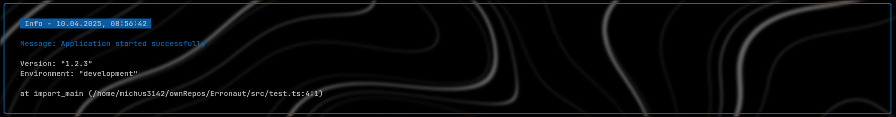
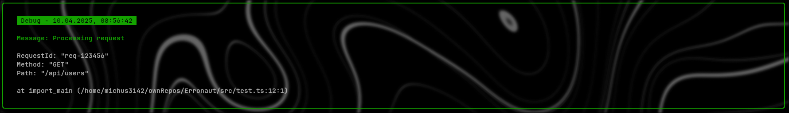
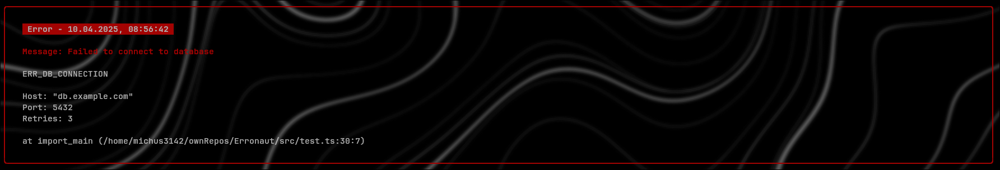

<h1 align="center">ERRONAUT</h1>

<p align="center"><em>Transform errors to elevate the debugging experience and read them seamlessly</em></p>

<hr>

<div align="center">

 <!--  -->

   


</div>

<hr>

## Overview

Erronaut is a modern TypeScript library designed to enhance error display in Node.js applications. Say goodbye to plain, confusing error messages and welcome beautifully formatted, informative error displays that make debugging a breeze.

## Features

- **Beautiful Error Formatting**: Transform cryptic error messages into visually appealing displays
- **Color-Coded Output**: Instantly identify error types with intuitive color schemes
- **Detailed Context**: Get more information about where and why errors occurred
- **TypeScript Support**: Fully typed for a better development experience
- **Lightweight**: Minimal dependencies, only using boxen and chalk

<hr>

## Usage

### Setup
All you need is to import full package using
```JavaScript
import "erronaut";
```
This will setup error interceptors

If you only want to display other statements (Info, Debug, Warn) silply import them using
```JavaScript
import { Info, Debug, Warn } from "erronaut";
```

#### Info



```JavaScript
new Info({
  message: "Application started successfully",
  details: {
    version: "1.2.3",
    environment: "development",
  },
});
```

#### Debug


```JavaScript
new Debug({
  message: "Processing request",
  details: {
    requestId: "req-123456",
    method: "GET",
    path: "/api/users",
  },
});
```

#### Warn


```JavaScript
new Warn({
  message: "High resource usage detected",
  details: {
    cpu: "85%",
    memory: "1.2GB",
    threshold: "80%",
  },
});
```

#### Error


```JavaScript
throw new Error({
  code: "ERR_DB_CONNECTION",
  message: "Failed to connect to database",
  details: {
    host: "db.example.com",
    port: 5432,
    retries: 3,
  },
});
```

and code will automatically intercept all default errors such as 
```JavaScript
const x = 4;
x = 5;
```

<hr>

Made with ❤️ by [Mnichus3142](https://github.com/Mnichus3142)